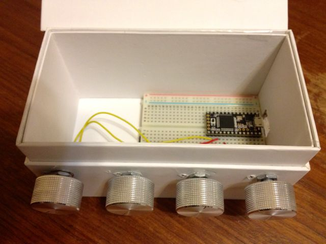

# Flocking.js: Declarative Javascript Audio for Artists

_Flocking_ is a web-based framework for audio synthesis, composition, and performance [1]. This paper will position Flocking within the emerging context of web audio tools and techniques, providing an overview of the challenges and potential of making music on the web. By embracing the ubiquity and flexibility of web-based technologies, Flocking attempts to support a broad community of digital instrument designers and composers. Written entirely in JavaScript, Flocking applications can run on a variety of platforms including traditional desktop operating systems as well as mobile platforms. Flocking also is used by the author to create sound installations and compositions on embedded platforms such as the popular Raspberry Pi computer using Node.js. Several recent pieces will be demonstrated.

Unlike traditional music frameworks, Flocking is based on a declarative approach that represents instruments and compositions as data rather than code. In Flocking, synths and scores alike are composed from collections of unit generators that are specified as trees of JavaScript Object Notation (JSON) objects. JSON is a popular format for exchanging data between programs and web services, and is very easy to generate and parse using nearly any programming language [2]. Flocking's declarative approach represents a form of _metaprogramming_ that can support the creation of programs that are able to understand and transform the structure and content of an instrument or musical algorithm. For example, the author, supported by students funded by the Google Summer of Code program, is working on graphical tools for creating and editing instruments built with Flocking. The goal is to enable musicians who are more comfortable with visual flow environments such as Max/MSP to collaborate directly with developers who prefer traditional text-based computer music programming.

_Example 1_: An synth definition for a simple frequency modulation instrument, consisting of a tree of unit generators represented in JSON format:

    {
        synthDef: {
            id: "carrier"
            ugen: "flock.ugen.sin",
            mul: 0.3,
            freq: {
                ugen: "flock.ugen.value",
                value: 400,
                add: {
                    id: "modulator",
                    ugen: "flock.ugen.sin",
                    mul: 150,
                    freq: 124
                }
            }
        }
    }

Flocking provides a very flexible means for reusing and adapting instruments and compositions. A simple but powerful object merging algorithm allows musicians to overlay their own customizations onto an existing instrument without having to directly change its internals. This helps to promote the sharing of modules amongst a body of compositions and across communities of digital instrument designers.

Recently, support has been added for Open Sound Control-based hardware controllers [3], providing a way for musicians to bind physical input sources to their Flocking-based software instruments. An example of a simple OSC controller, dubbed the _Flock Box_, will be demonstrated, illustrating Flocking's flexible tools for binding and transforming control input to suit different instruments and performance scenarios. The Flock Box consists of four potentiometers connected to a Teensy embedded controller [4] that issues OSC value changes each time a pot is moved.

_Image 1_: The _Flock Box_, a home-built Open Sound Control controller that can be used with Flocking:

Using Flocking's Open Sound Control library, the OSC addresses and values sent by the Flock Box and other OSC sources can be mapped and transformed to arbitrary inputs within an instrument's unit generator tree using a declarative _input map_ specification.

_Example 2_: A declarative input map, which binds instrument inputs (keys) to incoming OSC message addresses (values).

    inputMap: {
        "carrier.freq.value": "pots.0",
        "modulator.freq": "pots.1",
        "modulator.mul": "pots.2"
    }

Flocking is still under active development and currently provides a fairly small collection of built-in unit generators and instruments. Nonetheless, it has proved to be highly germane to the author's own musical practice, supporting a conversation between the composition process and the emerging technical capabilities of the system. It has promoted a compositional approach that embraces constraints and an aesthetic of making the most out of small, composable building blocks. Flocking is a viable musical tool for composers and sound artists working in a variety of media and styles, and is available on Github for use and modification under a liberal open source license [5].

References

[1] http://flockingjs.org

[2] Crockford, Douglas. _Introducing JSON_. Web. http://www.json.org/ Accessed February 21, 2014.

[3] Wright, Matt. _The Open Sound Control 1.0 Specification_. http://opensoundcontrol.org/spec-1_0 Web. Accessed February 21, 2014.

[4] Stoffregen, Paul and Robin Coon. _Teensy USB Development Board_. Web. https://www.pjrc.com/teensy/ Accessed February 21, 2014.

[5] https://github.com/colinbdclark/Flocking
